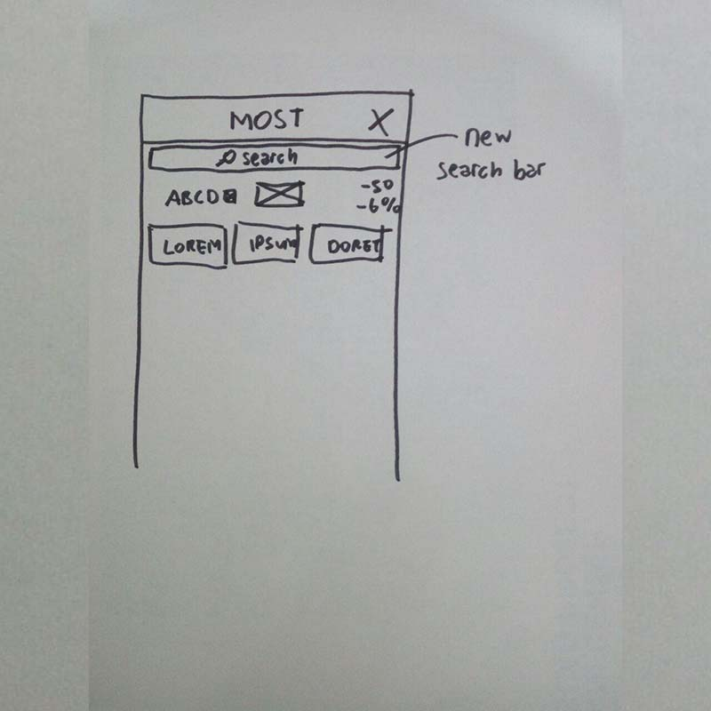

final-project-april-mei created by GitHub Classroom
Group members:
1. Mikael Mahendra Buyung Wirasukma - 05111640000044
2. Muhammad Aufa Wibowo - 05111640000184
3. Farhan Zuhdi - 05111640000070

# Usability Evaluation of MOST

## Description
The stock market refers to the collection of markets and exchanges where the regular activities of buying, selling and issuance of shares of publicly held companies take place. To buy/sell an issuance of shares, investors must done it from broker or securities firm.

Securities firm in Indonesia try to provide their best service to investors. One of them is Mandiri Sekuritas. MOST is a mobile application for Mandiri Sekuritas's client (hereinafter referred to as investors). Investors can do basic operation to their account such as buying stocks, selling stocks, checking portofolio, check current equity.

## Instruction Script

1.  Buy and Sell Stock
2.	Check portofolio
3.	Check current equity
4.	Use money withdraw feature
5.	Find stock's financial fact
6.  Logout-Login Experience

## User Description
### Participant 1
- User is a female student of Informatics Department ITS.
- She is able to use smartphone.
- She has just learned stock investing.

### Participant 2
- User is male student of Informatics Department ITS.
- He is able to use smartphone and PC.
- He knows a little about stock investing.

### Participant 3
- User is male student of Marine Engineering Department ITS.
- He is able to use smartphone.
- He has just learned about stock investing.

## Transcript
### Transcript of Participant 1

1. **AprilMei** : Terima kasih bersedia membantu saya untuk meluangkan waktu interview.. Ini merupakan aplikasi saham, prinsipnya sama. Lalu jika kita kalo mau beli saham gimana?
2. **Participant** : Ini, order. Yeay
3. **AprilMei** : Lalu kalo kita mau lihat portofolio bagaimana, Mas?
4. **Participant** : Nah, ini ada tulisannya kok.
5. **AprilMei** : Ini masih gampang ya. Selanjutnya, kalo kita mau lihat laporan keuangan sebuah bank gimana?
6. **Participant** : Ini saya coba BRI ya, yang syariah atau tidak?
7. **AprilMei** : Bebas, lalu gimana lihat laporan keuangannya?
8. **Participant** : Wah (kesulitan)tidak ada. Eh, dikasih tau hehe
9. **AprilMei** : Karena ini saham, gandengannya reksa dana. Kalo mau cari reksa dana di sini gimana caranya?
10. **Participant** : Aduh gimana ya Mas? Saya gaptek ini kurang paham. Kurang tergabung juga. Saya tidak menemukan mas, saya menyerah
11. **AprilMei** : Nggak boleh menyerah mas
12. **Participant** : Wah belum nemuin mas
13. **AprilMei** : Nah, bahasa inggrisnya reksa dana itu Mutual Fund.
14. **Participant** : Oalah, mana tadi ya. Ini apa, ada ini ya.
15. **AprilMei** : Nah sip, lali kalo kita mau narik uang kita gimana caranya?
16. **Participant** : Ini (with shortcut)
17. **AprilMei** : Coba sekarang log out.
18. **Participant** : Ya Allah, mana ini.
19. **AprilMei** : Coba kembalikan aplikasi dengan tombol back.
20. **Participant** : Nah ini udah keluar (Home HP)
21. **AprilMei** : Nah oke, tapi sebenernya saya ingin menunjukkan kalo kita menggunakan tombol back. Coba masuk aplikasinya dan keluar dengan tombol back.
22. **Participant** : Oh iya, ini gak bisa keluar, jadi kaya loop gitu ya.
23. **AprilMei** : Iya. Nah, menurutmu bagaimana dengan aplikasi ini?
24. **Participant** : Jadi, di tombol ini (bawah) itu font nya gak sama ya. Trus ini niatnya mau buat tampilan simple tapi jadinya ribet.
25. **AprilMei** : Dari segi experience, apalagi menurutmu?
26. **Participant** : Karena gak seberapa paham dengan saham, saya masih kurang paham dengan istilahnya. Mungkin ada guide untuk first usernya.
27. **AprilMei** : Oh iya, coba tekan register.
28. **Participant** : Lho kok mati? Oh, ini registernya gak bisa di aplikasi langsung ya?
29. **AprilMei** : Iya, ini jadi direct menuju ke alamat web dengan form yang lengkap.
30. **Participant** : Oh begitu, sip.
31. **AprilMei** : Iya, terima kasih ya atas waktunya.
32. **Participant** : Sama-sama.

### Transcript of Participant 2

1.	**AprilMei** : oke, thanks udah mau bantuin tugas saya nih
2.	**AprilMei** : jadi ini adalah app mandiri sekuritas untuk trading saham, ada beberapa hal yang akan kamu lakukan
3.	**AprilMei** : Pertama untuk cek fortofolio gmn?
4.	**Participant** : kalo cek fortofolio biasanya di menu bar harusnya ada profilenya dan tampilannya minimalis
5.	**Participant** : kalau disini aku liat tampilannya numpuk, jadi aku bingung dan gabisa liat karena terlalu banyak tulisan
6.	**Participant** : Mungkin tampilannya bisa dibikin lebih interaktif dan ga monoton
7.	**AprilMei** : Oke, nah biasanya setelah cek forto, misal kita mau order buy/sell. nah order buy/sellnya gmn tuh?
8.	**Participant** : Di menubarnya kan ada tulisan ordernya ya, jadi orang tinggal tekan order dan bisa bayar disini
9.	**AprilMei** : Nah, tiap app sekuritas biasanya yang diliatin laporan keuangan perusahaan. Kalau kita mau lihat itu gmn?
10.	(Disini participant cukup lama untuk menemukannya)
11.	**Participant** : Haha nyerah deh saya, ga ketemu"
12.	(Saya menunjukkan letak laporan tersebut)
13.	**Participant** : Wah ribet banget ya nyarinya.
14.	**AprilMei** : Iya emg appnya yang ribet ini haha
15.	**AprilMei** : Selanjutnya, coba logout terus login lagi
16.	(participant kembali mencari cara logout dengan waktu yang cukup lama)
17.	**Participant** : Sepertinya gaada deh, saya ganemu"
18.	**AprilMei** : ada kokk
19.	**Participant** : Duh banyak banget yang ga guna ini, gatau aku.
20.	(participant berhasil menemukan logout)
21.	**Participant** : Lah hahaha, jelek banget parah.
22.	**AprilMei** : Tadi sebenernya kamu udah liat itu.
23.	**Participant** : Iya ga galiat aku posisinya dibawah
24.	**AprilMei** : Nah tadi kan udah logout, coba sekarang keluar dari app terus login lagi
25.	(participant menemukan login dengan mudah)
26.	**Participant** : Wah gampang ya nyari loginnya
27.	**AprilMei** : Iya jadi app ini kalo kita ingin masuk ke menu" yang private maka akan di direct ke login page.
28.	**AprilMei** : Nah, tadi kan kita butuh funds, nah funds ini kan reksadana, coba kalau order reksadana gimana?
29.	(participannt menemukan cara order reksadana)
30.	**Participant** : Bener ini caranya?
31.	**AprilMei** : Iya bener
32.	**Participant** : Hmm aneh banget
33.	**AprilMei** : Nah salah satu fitur fundamental di app trading saham itu ada sorting saham berdasarkan kriteria tertentu? coba kalau kita mau melihat saham yang paling untung atau paling rugi gimana?
34.	(participant cukup lama dalam menemukan menu tersebut)
35.	**Participant** : ohh ini?
36.	**AprilMei** : betul. Terus kita mau transfer uang dari rekening sini ke rekening bank, itu gimana caranya?
37.	**Participant** : ohh tuh ada, langsung keliatan menunya.
38.	**AprilMei** : Nah benar. jadi gimana opinimu tentang app ini?
39.	**Participant** : Kelebihannya terlalu detail. Kekurangannya terlalu banyak fitur, tetapi tidak ditata rapih dan banyak juga fitur" yang tidak perlu seperti exit.
40.	**AprilMei** : Kalau login/logout experiencenya gimana tadi?
41.	**Participant** : Wah aneh banget sih. aku kira ada di setting atau di user, tapi ini malah dibawah.
42.	**Participant** : Lagian ini menubar nya cuma tulisan aja, harusnya pakai logo/icon.
43.	**AprilMei** : Oke itu aja, thanks ya.
44.	**Participant** : Oke.

### Transcript of Participant 3

1.	**AprilMei** : Aku mau minta tolong nih, jadi kamu menilai app Mandiri Sekuritas. Nilai kekurangan/kelebihannya
2.	**Participant** : oke, mana coba liat appnya
3.	**AprilMei** : Nah coba nih, misal kita mau buy stocks, gmn caranya?
4.	**Participant** : oh itu tinggal pencet order ga sih?
5.	**AprilMei** : oke gampang ya.
6.	**AprilMei** : Sekarang coba cek fortofolio
7.	(Participant langsung menemukan fortofolio)
8.	**AprilMei** : oke gampang juga ya.
9.	**AprilMei** : Coba sekarang cek laporan keuangan perusahaan.
10.	**Participant** : Laporan keuangan perusahaan... kalo disini kurang tau aku.
11.	**AprilMei** : Iya coba kamu cari.
12.	(Participant mencari-cari laporan keuangan)
13.	**Participant** : Gatau aku sumpah, haha.
14.	**AprilMei** : Coba-coba dulu.
15.	**Participant** : Oh ini ga sih? iya bener ini nih financial statement.
16.	**AprilMei** : Oke, selanjutnya disini ada yang namanya reksadana, kalau mau beli reksadana gimana?
17.	**Participant** : Oke, coba aku cari di menu dulu ya.
18.	**Participant** : Ini macem" reksadananya bukan?
19.	**AprilMei** : iya bener, kalau mau beli reksadananya gmn?
20.	**Participant** : Ini bukan sih?
21.	**AprilMei** : Nah iya bener. Nah, misal kita mau fund transfer, kan ada duit nih. Kalau kita mau ambil duitnya gmn?
22.	**Participant** : Nih, account terus fund transfer.
23.	**AprilMei** : Oke sekarang kalau mau logout gmn?
24.	**Participant** : Loh ini ada signout, tinggal pencet aja.
25.	**AprilMei** : Kalau keluar aplikasi gimana?
26.	**Participant** : Yaudah tinggal pencet back aja kayak app lainnya.
27.	**Participant** : Oh gabisa ya.
28.	**Participant** : Iya, jadi anehnya di Mandiri Sekuritas itu kalau tekan back seperti biasanya itu bakal loop terus. Gaakan bisa keluar.
29.	**AprilMei** : Jadi setelah nyoba app ini gimana opinimu?
30.	**Participant** : Sebenernya appnya standar aja sih sama kayak app lainnya, tapi app ini masih lebih bagus sih dari pada indo premier.
31.	**AprilMei** : Bagusnya kenapa?
32.	**Participant** : Bagusnya ya kalau mau ngorder gampang, semuanya lengkap sih untuk" fitur. 
33.	**AprilMei** : Kalau dari mudah atau ngganya mengakses suatu fitur, gimana?
34.	**Participant** : Cukup praktis sih.
35.	**AprilMei** : Wah malah kamu bilang bagus ya, padahal orang" banyak komentarnya jelek. Misal menubarnya ini terlalu banyak tulisan, bikin bingung jadinya.
36.	**Participant** : Ohh iya juga sih. Tapi, ya emang app sekuritas ga semua orang bisa pakai sih.
37.	**AprilMei** : Oke, jadi overall app ini oke ya?
38.	**Participant** : iya.

### Feedback and Incidence Analysis

#### OBSERVATION 1 (Login Operation)

 - **Reference**: Participant 1: 8, Participant 2: 2
 - **Feedback**: Welcome page and login page is still the same with current app.
 - **Incidence**: None.
 - **Reason**: None.
 - **Resolution**: Design a new login page.
 
#### OBSERVATION 2 (Buy / Sell Operation)

 - **Reference**: Participant 1: 8, Participant 2: 2
 - **Feedback**: Overall good. Buy Stock Page is still the same with current app.
 - **Incidence**: None.
 - **Reason**: None.
 - **Resolution**: Design a new login page.
 
#### OBSERVATION 3 (Financial Fact)

 - **Reference**: Participant 1: 16, Participant 2: 8
 - **Feedback**: There is no search bar to find another stock.
 - **Incidence**: None.
 - **Reason**: None.
 - **Resolution**: Add search bar.
 
## Prototyping
### Sketch

### Design Rationale
It is important that design should address spesific user. Not all user able to intuitively interact with the design that designers create. Hence, user-based design is fundamental to determine the design itself.
