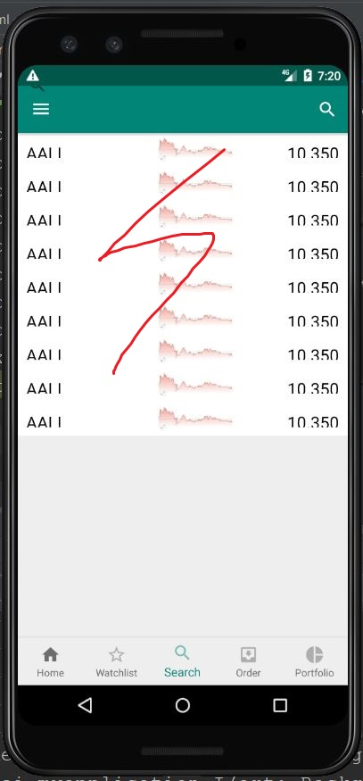
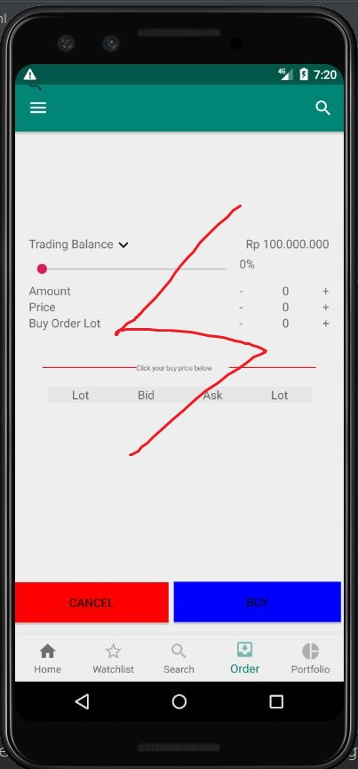
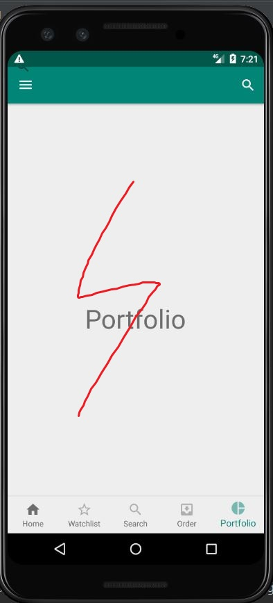

final-project-april-mei created by GitHub Classroom
Group members:
1. Mikael Mahendra Buyung Wirasukma - 05111640000044
2. Muhammad Aufa Wibowo - 05111640000184
3. Farhan Zuhdi - 05111640000070

# Usability Evaluation of MOST

## Description
The stock market refers to the collection of markets and exchanges where the regular activities of buying, selling and issuance of shares of publicly held companies take place. To buy/sell an issuance of shares, investors must done it from broker or securities firm.

Securities firm in Indonesia try to provide their best service to investors. One of them is Mandiri Sekuritas. MOST is a mobile application for Mandiri Sekuritas's client (hereinafter referred to as investors). Investors can do basic operation to their account such as buying stocks, selling stocks, checking portofolio, check current equity.

## Instruction Script

1. Login into the Apps
2.	Check portofolio
3.	Order
4.	Search for company
5.	Find account balance

## User Description
### Participant 1
- User is a male student of Civil Engineering ITS.
- he is able to use smartphone.

### Participant 2
- User is male student Naval Architecture Department ITS.
- He is able to use smartphone and PC.
- He knows a little about stock investing.

## Transcript
### Transcript of Participant 1

1. **AprilMei** : Lagi kosong ga?
2. **Participant** : Iya, kenapa?
3. **AprilMei** : Ini, coba test prototype aplikasiku.
4. **Participant** : Oke, ngapain dulu nih?
5. **AprilMei** : Coba login dulu.
6. **Participant** : Username password bebas kyk waktu itu lagi?
7. **AprilMei** : Iya.
8. **Participant** : Dah nih, apalagi?
9. **AprilMei** : Kalau mau menampilkan perusahaan yang di pantau dimana?
10. **Participant** : Nah, ini ada menunya dibawah.
11. **AprilMei** : Kalau mau order di mana ya?
12. **Participant** : Ini udah keliatan kok.
13. **AprilMei** : Ini masih gampang ya. Selanjutnya, kalo kita mau lihat saldo yang dimiliki dimana?
14. **Participant** : hmm
15. **Participant** : Yang ini bukan, mas?
16. **AprilMei** : Iya, betul
17. **Participant** : Tapi tulisannya itu mas kecil bgt, warnanya juga putih jadi hampir ga liat tadi
18. **AprilMei** : Ohh begitu ya, makasih masukannya.
19. **AprilMei** : Kalau, mau mecari perusahaan kira" dimana? 
20. **Participant** : oh yg search ini ya? rada error tapi tuh tampilannya, tulisannya kepotong"
21. **AprilMei** : Haha iya masih agak ngebug ini
22. **Participant** : Oalahh, masih ada lagi, mas?
23. **AprilMei** : Gaada lagi sih, kira-kira gimana appnya? 
24. **Participant** : Untuk tampilan sih udah cukup bagus menurutku, cuma ya itu tulisannya di profile sama bagian ordernya kecil bgt.
25. **AprilMei** : Okee, cukup segitu dulu. Makasih banyak ya.
26. **Participant** : Sama-sama.

### Transcript of Participant 2

1.	**AprilMei** : oke, thanks udah mau bantuin tugas saya nih.
2.	**AprilMei** : jadi ini adalah app mandiri sekuritas untuk trading saham, ada beberapa hal yang akan kamu lakukan.
3.	**AprilMei** : Pertama coba kamu login dulu.
4.	**Participant** : oke, Akunnya apa nih mas?
5.	**AprilMei** : untuk sekarang isi ngasal aja gapapa kok, soalnya ini cuma prototype
6.	**Participant** : Bisa nih, ada apa lagi
7.	**AprilMei** : Oke, nah sekarang kalau mau nampilin perusahan yang di pantau gmn tuh?
8.	**Participant** : Di Watchtlist ini kan?
9.	**AprilMei** : Iya, sekarang coba cek saldo?
10.	**Participant** : Ini dibawah tampilan foto bukan sih? samar" keliatannya
11.	**Participant** : Ohiya bener ini saldonya.
12. **AprilMei** : nah kan tadi kan udah liat saldo ya, sekarang coba kalau mau order gimana?
13.	**Participant** : Udah, tapi gabisa di klik tambahnya mas
14.	**Participant** : Terus yg dibawah ini apaan ya mas? kok kosong
15.	**AprilMei** : iya itu sementara buat tampilan dulu, yg di bawah itu tabelnya.
16. **AprilMei** : Kalau mau liat portofolio dmn tuh?
17. **Participant** : Nih, emg tulisannya portofolio aja?
18.	**AprilMei** : Iya blom sempet bikin, soalnya kemaren problemnya portofolio susah dicari.
19. **AprilMei** : Udah ya itu dulu, Makasih ya.
19. **Participant** : iya sama-sama.

### Feedback and Incidence Analysis

#### OBSERVATION 1 (Login)

 - **Reference**: Participant 1: 5, Participant 2: 3
 - **Feedback**: None.
 - **Incidence**: None.
 - **Reason**: None.
 - **Resolution**: None.
 
#### OBSERVATION 2 (Watchlist)

 - **Reference**: Participant 1: 9, Participant 2: 7
 - **Feedback**: None
 - **Incidence**: None.
 - **Reason**: None.
 - **Resolution**: Fix some of display error.
 
#### OBSERVATION 3 (Sidebar)

 - **Reference**: Participant 1: 13, Participant 2: 9
 - **Feedback**: Participant 1: 17, Participant 2: 10 : Text too small and barely visible because of the color.
 - **Incidence**: Participant almost cant see.
 - **Reason**: None.
 - **Resolution**: Make the text better sized and properly colored so the user can see it clearly.
 
 #### OBSERVATION 4 (Order)

 - **Reference**: Participant 1: 11, Participant 2: 9
 - **Feedback**: Participant 1: 24, Partipant 2: 13 : Text too small, add button not working and, table at the bottom blank
 - **Incidence**: None.
 - **Reason**: None.
 - **Resolution**: Edit text size, change the add and substract button into input type.
 
 #### OBSERVATION 5 (Portofolio)
 

 - **Reference**: Participant 2: 2
 - **Feedback**: None.
 - **Incidence**: The page only contain "Portofolio" word.
 - **Reason**: Haven't got the time to design proper portofolio page.
 - **Resolution**: Design a page for Portofolio.
 
  
## Prototyping
### Sketch
#### Watchlist

#### Sidebar

#### Search

#### Order

#### Portofolio

### Design Rationale
It is important that design should address spesific user. Not all user able to intuitively interact with the design that designers create. Hence, user-based design is fundamental to determine the design itself.
### High-Fidelity Interactive-Prototype
https://youtu.be/TpDGpU6MUeM
